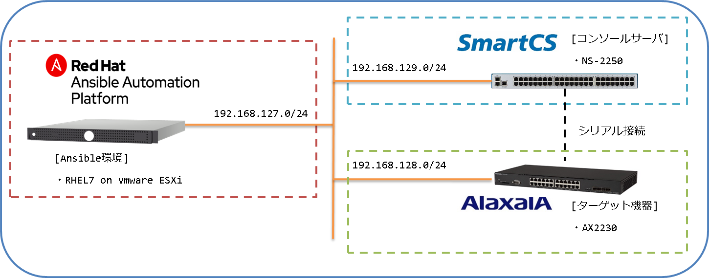

[↑目次に戻る](/README.md)
<br>
# 演習1.1　演習環境の確認
演習1.1では、本日のハンズオンの演習環境の確認を行います。
<br>

## 目次
本演習では以下を行います。
- STEP1. SmartCSのユーザ情報とバージョン情報を確認する
- STEP2. Ansibleのバージョンを確認する
- STEP3. Ansibleの設定情報を確認する
- STEP4. AnsibleのInventory情報を確認する

## 演習構成図


無線LAN環境
```
SSID:xxxxx
Pass:xxxxx
```

### ユーザ毎環境

|# | RHELユーザID/Pass | RHEL IP |  ALAXALA IP | SmartCS IP(注意) | 
|:---|:---|:---|:---|:---|
|1  |rhel01 / secret01 |192.168.127.2/24 |192.168.128.2/24 |192.168.129.**2**/24 |
|2  |rhel02 / secret02 |192.168.127.3/24 |192.168.128.3/24 |192.168.129.**2**/24 |
|3  |rhel03 / secret03 |192.168.127.4/24 |192.168.128.4/24 |192.168.129.**2**/24 |
|4  |rhel04 / secret04 |192.168.127.5/24 |192.168.128.5/24 |192.168.129.**2**/24 |
|5  |rhel05 / secret05 |192.168.127.6/24 |192.168.128.6/24 |192.168.129.**2**/24 |
|6  |rhel06 / secret06 |192.168.127.7/24 |192.168.128.7/24 |192.168.129.**3**/24 |
|7  |rhel07 / secret07 |192.168.127.8/24 |192.168.128.8/24 |192.168.129.**3**/24 |
|8  |rhel08 / secret08 |192.168.127.9/24 |192.168.128.9/24 |192.168.129.**3**/24 |
|9  |rhel09 / secret09 |192.168.127.10/24 |192.168.128.10/24 |192.168.129.**3**/24 |
|10 |rhel10 / secret10 |192.168.127.11/24 |192.168.128.11/24 |192.168.129.**3**/24 |

> RHELユーザのIDは適当です

### ユーザ毎のコンソールサーバ SmartCS環境

|# | SmartCS IP |使用するtty |ラベル名 | ポートアクセス用ID/Pass | Ansibleアクセス用ID/Pass | 
|:---|:---|:---|:---|:---|:---|
|1  |192.168.129.**2**/24 |1  |AX-2230_1 |port01  / secret01 |user01  / secret01 |
|2  |192.168.129.**2**/24 |9  |AX-2230_2 |port02  / secret02 |user02  / secret02 |
|3  |192.168.129.**2**/24 |17 |AX-2230_3 |port03  / secret03 |user03  / secret03 |
|4  |192.168.129.**2**/24 |25 |AX-2230_4 |port04  / secret04 |user04  / secret04 |
|5  |192.168.129.**2**/24 |33 |AX-2230_5 |port05  / secret05 |user05  / secret05 |
|6  |192.168.129.**3**/24 |1  |AX-2230_6 |port06  / secret06 |user06  / secret06 |
|7  |192.168.129.**3**/24 |9  |AX-2230_7 |port07  / secret07 |user07  / secret07 |
|8  |192.168.129.**3**/24 |17 |AX-2230_8 |port08  / secret08 |user08  / secret08 |
|9  |192.168.129.**3**/24 |25 |AX-2230_9 |port09  / secret09 |user09  / secret09 |
|10 |192.168.129.**3**/24 |33 |AX-2230_10 |port10 / secret10 |user10 / secret10 |

<br>
<br>

### STEP1. 使用するネットワーク機器のバージョン情報を確認する

■SmartCS（NS-2250-48）
```
System                : System Software Ver 2.1 (Build 2019-09-26)
Boot Status           : Reboot (05:80:00)
System Up Time        : 2020/01/10 14:15:49
Local MAC Address     : 00:80:15:42:00:08
Number of MAC Address : 2
Model                 : NS-2250-16 (16 port)
Serial No.            : 56000050
BootROM               : Ver 1.0
Main Board CPU        : e500v2 (533.333328MHz)
Main Memory           : 1025264 KBytes
Boot System           : main (Ver 2.1)
Boot Config           : internal startup1
Main System           : Ver 2.1
Backup System         : Ver 2.1
```
※`System`が`System Software Ver 2.1`である事を確認して下さい。

■ALAXALA（AX-2230-24T-B）
```
Date 1980/05/05 02:17:50 UTC
Model: AX2230S-24T
S/W: OS-LT4 Ver. 2.9 (Build:04)
H/W: AX-2230-24T-B [CA022B24T000S0000C7S013:0]
```
※演習4.3でF/Wバージョンアップを行うので、`S/W`が`2.9 (Build:04)`である事を確認してください。

<br>
<br>

### STEP2. Ansibleのバージョンを確認する

Ansibleを使った演習（演習3、演習4）については以下のAnsibleバージョンで行います。
```
$ ansible --version
ansible 2.8.2
  config file = /etc/ansible/ansible.cfg
  configured module search path = ['/home/xxxxx/.ansible/plugins/modules', '/usr/share/ansible/plugins/modules']
  ansible python module location = /home/xxxxxx/.pyenv/versions/3.6.8/lib/python3.6/site-packages/ansible
  executable location = /home/nakayama/.pyenv/versions/3.6.8/bin/ansible
  python version = 3.6.8 (default, Jan  8 2020, 01:03:09) [GCC 4.8.5 20150623 (Red Hat 4.8.5-39)]
$ 
```
※Ansibleのバージョンが`2.8.2`である事を確認して下さい。

> MEMO
> RHELの環境によってまだ変わる可能性有 特にPythonのバージョン

また、SmartCS及びALAXLA用のAnsibleモジュールのバージョンについて、本演習では以下を使用します

| |SWバージョン |
|:---|:---|
|Ansible |2.8.2 |
|SmartCS module for Ansible |1.1 |
|AX modules for Ansible |1.4 |

<br>
<br>


### STEP3. Ansibleの設定情報を確認する

<code>ansible.cfg</code>の設定変更差分
```
$ ansible-config dump --only-changed
DEFAULT_LOG_PATH(/etc/ansible/ansible.cfg) = /var/log/ansible.log
HOST_KEY_CHECKING(/etc/ansible/ansible.cfg) = False
$ 
```

<br>
<br>

### STEP4. AnsibleのInventory情報を確認する

<code>/etc/hosts</code>（#1ユーザの場合）
```
192.168.127.2   rhel
192.168.128.2   ax
192.168.129.2   smartcs
```


<code>/etc/ansible/hosts</code>（#1ユーザの場合）
```
smartcs         ansible_user=user1 ansible_password=user1
ax              ansible_user=alaxala ansible_password=secret2230
```

> メモ
> - smartcsの設定は事前に全て投入しておく。（演習内ではSmartCSの設定作業は行わない）  
> - axのIP設定は演習3.1で投入する（ただ、/etc/hostsファイルにはエントリ追加しておいてよいかと）  
> - /etc/ansible/hosts（インベントリファイル）について  
>   3.1演習でIP設定後、/etc/ansible/hosts には演習内で追記してもいいかもしれません。
>   か、/etc/ansible/hosts に直接書かず、ワーキングディレクトリにファイルを用意して都度 -i で指定するか、どちらがいいですかね。 


[→演習2.1 SmartCSを介してALAXALA装置へコンソールアクセスする](/2.1-serial_connection_to_alaxala_via_smartcs.md)  
[↑目次に戻る](/README.md)
