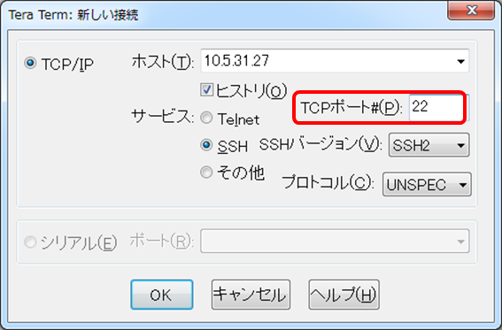

[↑目次に戻る](/README.md)
<br>
# 演習2.1　SmartCSを介してALAXALA装置へコンソールアクセスする
演習2.1では、SmartCSを介してALAXALA装置へのコンソールアクセスを行います。
<br>
TeratermなどのターミナルソフトからSmartCSへの接続時に、SmartCSの各シリアルポートに割り当てられたTCPポートを指定して
アクセスするダイレクトモードを使用します。

## 目次
本演習では以下を行います。
- STEP1. SmartCSのポートサーバーへノーマルモード(RW)でアクセスする
- STEP2. SmartCSを介してALAXALA装置へログインする
- STEP3. ALAXALA装置に対してコマンドを実行する
- STEP4. ALAXALA装置からログアウトする
- STEP5. SmartCSのシリアルセッションを終了する

## 演習構成図

> 後で載せる

### STEP1. SmartCSのポートサーバーへノーマルモード(RW)でアクセスする
ダイレクトモード、かつノーマルモード(RW)でSmartCSのポートサーバーへ接続します。
<br>
まず、Teratermなどのターミナルソフトを使用して、SSHでSmartCSへ接続します。
接続時に、TCPポート番号を8301と指定します。
<br>
- 参考
SmartCSのシリアルポートへの各アクセス方法において、シリアルポートに割り当てられているTCPポートは下記の通りです。

| 接続モード | プロトコル | セッション種別 | TCPポート |
| --- | --- | --- | --- |
| ダイレクトモード | Telnet | ノーマルモード(RW) | 8101～8148 |
|  |  | モニターモード(RO) | 8201～8248 |
|  | SSH | ノーマルモード(RW) | 8301～8348 |
|  |  | モニターモード(RO) | 8401～8448 |


アクセスに成功すると、以下のようなポートサーバーメニューが表示されます。
<br>

```
-- RW1 ------------------------
Host  : "NS-2250"
Label : "AX2230"
-------------------------------
1  : display Port Log
2  : display Port Log (LAST)
3  : start tty connection
4  : close telnet/ssh session
5  : show all commands
tty-1:rw>
```


### STEP2. SmartCSを介してALAXALA装置へログインする
ポートサーバーメニューからシリアルセッションを開始し、ALAXALA装置へログインを行います。
<br>
まず、<code>3  : start tty connection</code>を選択し、シリアルセッションを開始します。
<br>
続けてログインID（operator）を入力するとALAXALA装置にログインすることができます。
<br>

```
-- RW1 ------------------------
Host  : "NS-2250"
Label : "AX2230"
-------------------------------
1  : display Port Log
2  : display Port Log (LAST)
3  : start tty connection
4  : close telnet/ssh session
5  : show all commands
tty-1:rw> 3
Press "CTRL-Z" to return this MENU.
Start tty connection
operator

Copyright (c) 2012-2019 ALAXALA Networks Corporation. All rights reserved.

AX2230>
```


### STEP3. ALAXALA装置に対してコマンドを実行する
ALAXALA装置にログイン後、コマンドを実行します。
<br>
<code>AX2230></code>というプロンプトが表示されたら、<code>show version</code>コマンドを実行します。
<br>

```
AX2230> show version

Date 1980/04/10 03:41:23 UTC
Model: AX2230S-24T
S/W: OS-LT4 Ver. 2.10 (Build:01)
H/W: AX-2230-24T-B [CA022B24T000S0000C7S013:0]

AX2230>
```


### STEP4. ALAXALA装置からログアウトする
オペレーションが完了したら、コンソールを初期状態に戻すためにログアウトを行います。
<br>
<code>exit</code>コマンドを実行してALAXALA装置からログアウトします。
<br>

```
AX2230> exit

login: 
```


### STEP5. SmartCSのシリアルセッションを終了する
ログアウト後はSmartCSを介したシリアルセッションを終了させます。
<br>
ALAXALA装置からのログアウトが完了したら、Ctrl+Zを入力してポートサーバーメニューに戻ります。
<br>
その後、<code>4  : close telnet/ssh session</code>を選択して終了します。
<br>

```
login: 
-- RW1 ------------------------
Host  : "NS-2250"
Label : "AX2230"
-------------------------------
1  : display Port Log
2  : display Port Log (LAST)
3  : start tty connection
4  : close telnet/ssh session
5  : show all commands
tty-1:rw> 4
```


### 参考情報1. セレクトモード
本ハンズオンではダイレクトモードでALAXALA装置にアクセスを行いますが、SmartCSを介したもう1つのアクセス方法としてセレクトモードがあります。
<br>
セレクトモードではSmartCSの代表ポート(SSHの場合は22)を指定してアクセスし、ポートユーザ認証を行います。



ポートユーザでログインすると、アクセス可能なシリアルポートの一覧(ポートセレクトメニュー)が表示され、ポート番号(tty)を選択してアクセスを行います。
<br>

```
Host : "NS-2250" 
login from 10.208.39.104
user (port1) Access TTY List
===========================================================================
 tty : Label                                RW     RO
---------------------------------------------------------------------------
   1 : AX2230                                0      0
   2 : AX2230_backup                         0      0
---------------------------------------------------------------------------
Enter tty number to access serial port
 <ttyno>          : connect to serial port RW session ( 1  - 48  )
 <ttyno>r         : connect to serial port RO session ( 1r - 48r )
 l                : show tty list 
 l<ttyno>-<ttyno> : show a part of tty list
 d                : show detail tty list 
 d<ttyno>-<ttyno> : show a part of detail tty list
 h                : help message 
 e                : exit 
===========================================================================
tty> 1
```

1つのシリアルポートへのオペレーションが終了したら、切替文字コードを入力することでポートサーバーメニューへ戻り、<code>0  : return Port Select Menu</code>を選択することでポートセレクトメニューへ戻ることができます。
<br>
新たにターミナルを立ち上げ直すことなく、別のシリアルポートへアクセスを切り替えることが可能となります。
<br>

```
AX2230> exit

login: 
-- RW1 ------------------------
Host  : "NS-2250"
Label : "AX2230"
-------------------------------
0  : return Port Select Menu
1  : display Port Log
2  : display Port Log (LAST)
3  : start tty connection
4  : close telnet/ssh session
5  : show all commands
tty-1:rw> 0
return Port Select Menu

Host : "NS-2250" 
login from 10.208.39.104
user (port1) Access TTY List
===========================================================================
 tty : Label                                RW     RO
---------------------------------------------------------------------------
   1 : AX2230                                0      0
   2 : AX2230_backup                         0      0
---------------------------------------------------------------------------
Enter tty number to access serial port
 <ttyno>          : connect to serial port RW session ( 1  - 48  )
 <ttyno>r         : connect to serial port RO session ( 1r - 48r )
 l                : show tty list 
 l<ttyno>-<ttyno> : show a part of tty list
 d                : show detail tty list 
 d<ttyno>-<ttyno> : show a part of detail tty list
 h                : help message 
 e                : exit 
===========================================================================
tty> 2
```


### 参考情報2. ポートログの確認
SmartCSを介した操作による入出力情報、およびシリアル接続機器から自発的に出力される情報(再起動ログなど)を保存する機能(ポートログ保存機能)があります。
<br>
保存されているポートログは、ポートサーバーメニューで<code>1  : display Port Log</code>を選択して表示することができます。
<br>
また、<code>2  : display Port Log (LAST)</code>を選択すると最新の約5000文字を表示することができます。
<br>

```
-- RW1 ------------------------
Host  : "NS-2250"
Label : "AX2230"
-------------------------------
1  : display Port Log
2  : display Port Log (LAST)
3  : start tty connection
4  : close telnet/ssh session
5  : show all commands
tty-1:rw> 2

login: operator

Copyright (c) 2012-2019 ALAXALA Networks Corporation. All rights reserved.

AX2230> 
AX2230> set terminal pager disable
AX2230> show version
```


[→演習2.2 SmartCSを介したALAXALA装置へのコンソールアクセスを、別セッションでミラーリングする](/2.2-mirroring_operation_of_smartcs.md)  
[↑目次に戻る](/README.md)

