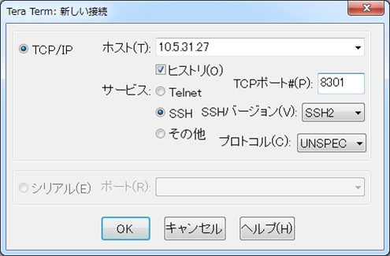
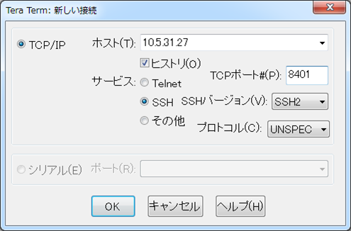

[↑目次に戻る](/README.md)
<br>
# 演習2.2　SmartCSを介したALAXALA装置へのコンソールアクセスを、別セッションでミラーリングする
演習2.2では、SmartCSを介したALAXALA装置へのコンソールアクセスに対し、別セッションでミラーリングを行います。
<br>
TeratermなどのターミナルソフトからSmartCSへの接続時に、SmartCSの各シリアルポートに割り当てられたTCPポートを指定して
アクセスするダイレクトモードを使用します。

## 目次
本演習では以下を行います。
- STEP1. SmartCSのポートサーバーへノーマルモード(RW)でアクセスする
- STEP2. SmartCSを介してALAXALA装置へログインする
- STEP3. SmartCSのポートサーバーへモニターモード(RO)でアクセスする
- STEP4. ALAXALA装置に対してコマンドを実行し、ミラーリングを行う
- STEP5. ALAXALA装置からログアウトする
- STEP6. SmartCSのシリアルセッションを終了する

## 演習構成図

> 後で載せる

### STEP1. SmartCSのポートサーバーへノーマルモード(RW)でアクセスする
ダイレクトモード、かつノーマルモード(RW)でSmartCSのポートサーバーへ接続します。
<br>
まず、Teratermなどのターミナルソフトを使用して、SSHでSmartCSへ接続します。
<br>
接続時に、TCPポート番号を8301と指定します。



アクセスに成功すると、以下のようなポートサーバーメニューが表示されます。
<br>

```
-- RW1 ------------------------
Host  : "NS-2250"
Label : "AX2230"
-------------------------------
1  : display Port Log
2  : display Port Log (LAST)
3  : start tty connection
4  : close telnet/ssh session
5  : show all commands
tty-1:rw>
```


### STEP2. SmartCSを介してALAXALA装置へログインする
ポートサーバーメニューからシリアルセッションを開始し、ALAXALA装置へログインを行います。
<br>
まず、<code>3  : start tty connection</code>を選択し、シリアルセッションを開始します。
<br>
続けてログインID（operator）を入力するとALAXALA装置にログインすることができます。
<br>

```
-- RW1 ------------------------
Host  : "NS-2250"
Label : "AX2230"
-------------------------------
1  : display Port Log
2  : display Port Log (LAST)
3  : start tty connection
4  : close telnet/ssh session
5  : show all commands
tty-1:rw> 3
Press "CTRL-Z" to return this MENU.
Start tty connection
operator

Copyright (c) 2012-2019 ALAXALA Networks Corporation. All rights reserved.

AX2230>
```


### STEP3. SmartCSのポートサーバーへモニターモード(RO)でアクセスする
STEP1のセッションを残したまま新しくターミナルを開き、ダイレクトモード、かつモニターモード(RO)でSmartCSのポートサーバーへ接続します。
<br>
まず、Teratermなどのターミナルソフトを使用して、SSHでSmartCSへ接続します。
<br>
接続時に、TCPポート番号を8401と指定します。



アクセスに成功するとシリアルセッションが開始し、以下のような内容が表示されます。
<br>
モニターモード(RO)でアクセスしているので、Enterや文字列などの入力ができないことをご確認ください。

```
Press "CTRL-Z" to disconnect this session.
Start tty connection

```


### STEP4. ALAXALA装置に対してコマンドを実行し、ミラーリングを行う
ALAXALA装置にログイン後、コマンドを実行します。
<br>
ノーマルモード(RW)のセッションで<code>AX2230></code>というプロンプトが表示されたら、<code>show version</code>コマンドを実行します。
<br>
以下のような実行結果が、モニターモード(RO)のセッションでも表示されることをご確認ください。
<br>

```
AX2230> show version

Date 1980/04/10 03:41:23 UTC
Model: AX2230S-24T
S/W: OS-LT4 Ver. 2.10 (Build:01)
H/W: AX-2230-24T-B [CA022B24T000S0000C7S013:0]

AX2230>
```


### STEP5. ALAXALA装置からログアウトする
オペレーションが完了したら、コンソールを初期状態に戻すためにログアウトを行います。
<br>
ノーマルモード(RW)のセッションで<code>exit</code>コマンドを実行して、ALAXALA装置からログアウトします。
<br>

```
AX2230> exit

login: 
```


### STEP6. SmartCSのシリアルセッションを終了する
ログアウト後はSmartCSを介したシリアルセッションを終了させます。
<br>
ノーマルモード(RW)のセッションでALAXALA装置からのログアウトが完了したら、Ctrl+Zを入力してポートサーバーメニューに戻ります。
<br>
その後、<code>4  : close telnet/ssh session</code>を選択して終了します。
<br>

```
login: 
-- RW1 ------------------------
Host  : "NS-2250"
Label : "AX2230"
-------------------------------
1  : display Port Log
2  : display Port Log (LAST)
3  : start tty connection
4  : close telnet/ssh session
5  : show all commands
tty-1:rw> 4
```

その後、モニターモード(RO)のセッションではCtrl+Zを入力するとターミナルが閉じ、セッションが終了します。


### 参考情報 playbook作成時にミラーリングを活用
- SmartCSを経由して動作させるplaybookを作成する際には、オペレーションが確実に実行されているかどうかをミラーリングの機能で確認することができます。
- SmartCS用のAnsibleモジュールを使用したplaybookを動作させる際には、シリアルポートに接続されている機器の出力内容を把握し、待ち文字としてplaybook内で定義する必要があります。(演習3.1 STEP1にて説明)
playbook作成の段階では、オペレーションが途中で停止してしまい対象機器から手動でログアウトさせたい場合がありますので、Ansibleによるオペレーションを実行しながらノーマルモード(RW)のセッションを別に開いておくと便利です。
- 誤操作防止のために上述の①Ansibleと②ノーマルモード(RW)のセッションは、デフォルトでは排他がかかるよう制限されています。本ハンズオンではplaybook作成時の利便性を考慮し排他設定を解除しております。


[→演習2.3 SmartCSを介したシリアルセッション情報を確認する](/2.3-checking_serial_session_information_of_smartcs.md)  
[←演習2.1 SmartCSを介してALAXALA装置へコンソールアクセスする](/2.1-serial_connection_to_alaxala_via_smartcs.md)  
[↑目次に戻る](/README.md)
