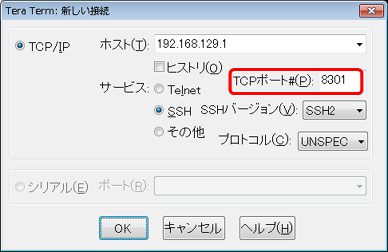

[↑目次に戻る](/README.md)
<br>
# 演習2.3　SmartCSを介したシリアルセッション情報を確認する
演習2.3では、SmartCSを介したALAXALA装置へのコンソールアクセスのセッション情報を確認します。
<br>
TeratermなどのターミナルソフトからSmartCSへの接続時に、SmartCSの各シリアルポートに割り当てられたTCPポートを指定して
アクセスするダイレクトモードを使用します。

## 目次
本演習では以下を行います。
- STEP1. SmartCSのポートサーバーへノーマルモード(RW)でログインする
- STEP2. SmartCSへ本体ログインする
- STEP3. SmartCSでシリアルセッション情報を確認する
- STEP4. SmartCSのシリアルセッションを終了する
- STEP5. SmartCS本体からログアウトする

## 演習構成図

> 後で載せる

### STEP1. SmartCSのポートサーバーへノーマルモード(RW)でログインする
ダイレクトモード、かつノーマルモード(RW)でSmartCSのポートサーバーへ接続し、ポートユーザでログインします。
<br>
まず、Teratermなどのターミナルソフトを使用して、SSHでSmartCSへ接続します。
<br>
このとき、SSH、ダイレクトモード、かつノーマルモード(RW)でのアクセスなので、シリアルポート1に割り当てられているTCPポート番号:8301を指定します。
<br>
各アクセス方法におけるポート番号は演習2.1の参考情報1を参照してください。



ポートユーザの認証には、ログインID（port01）、パスワード(secret01)を入力してログインします。
ログインに成功すると、以下のようなポートサーバーメニューが表示されます。
<br>

```
-- RW1 ------------------------
Host  : "NS-2250_Ansible_1"
Label : "AX-2230_1"
-------------------------------
1  : display Port Log
2  : display Port Log (LAST)
3  : start tty connection
4  : close telnet/ssh session
5  : show all commands
tty-1:rw>
```


### STEP2. SmartCSへ本体ログインする
STEP1のセッションを残したまま新しくターミナルを開き、SmartCSへ本体アクセスして拡張ユーザでログインを行います。
<br>
まず、Teratermなどのターミナルソフトを使用して、SSHでSmartCSへ接続します。
<br>
今回接続時に指定するTCPポート番号は22です。


ログインID（user01）、パスワード(secret01)を入力してログインを行います。
<br>
ログインに成功すると、<code>(1)NS-2250_Ansible_1> </code>というプロンプトが表示されます。


### STEP3. SmartCSでシリアルセッション情報を確認する
SmartCSへ本体ログイン後、シリアルセッション情報の確認を行います。
<br>
<code>(1)NS-2250_Ansible_1> </code>というプロンプトが表示されたら、<code>show portd session</code>コマンドを実行します。
<br>

```
(1)NS-2250_Ansible_1> show portd session
telnet rw :   0   ro :   0
ssh    rw :   1   ro :   0
available session ( telnet only : 95 / ssh only : 95 )
---------------------------------------------------------------------------
tty    : Label                                      Session-Limit 
   Type Login-User       Local     Remote
---------------------------------------------------------------------------
tty  1 : AX-2230_1                                  RW: 2 / RO: 3 
   rw 1 port01           ssh:8301  192.168.127.2:36712

(1)NS-2250_Ansible_1>
```


### STEP4. SmartCSのシリアルセッションを終了する
SmartCSを介したシリアルセッションを終了させます。
<br>
STEP1で表示させたポートサーバーメニューで、<code>4  : close telnet/ssh session</code>を選択して終了します。
<br>

```
login: 
-- RW1 ------------------------
Host  : "NS-2250_Ansible_1"
Label : "AX-2230_1"
-------------------------------
1  : display Port Log
2  : display Port Log (LAST)
3  : start tty connection
4  : close telnet/ssh session
5  : show all commands
tty-1:rw> 4
```

ポートサーバーメニューが終了したら、STEP3と同様の手順でシリアルセッション情報が削除されたことをご確認ください。


### STEP5. SmartCS本体からログアウトする
SmartCS本体からログアウトを行います。
<br>
<code>(1)NS-2250_Ansible_1> </code>というプロンプトの状態で、<code>exit</code>コマンドを実行します。
<br>

```
(1)NS-2250_Ansible_1> exit
```


### 参考情報1. ユーザ権限
演習2、および演習3以降のAnsible playbookで指定するユーザは、「拡張ユーザ」グループのユーザです。
拡張ユーザはAnsibleなどのツールと連携するttyマネージ機能を利用するためのユーザです。
STEP2、STEP3のようにSmartCSへ本体ログインして一部の情報取得コマンドは実行可能ですが、設定情報の取得や設定変更は実施できません。
設定情報の取得や設定変更を実行する場合、<code>su</code>コマンドで装置管理ユーザに移行する必要があります。

- 一般ユーザ：SmartCSへ本体ログインし、設定情報の取得、および設定変更を除くコマンド実行が可能なユーザ
- 装置管理ユーザ：一般ユーザや拡張ユーザから<code>su</code>コマンドで移行し、設定情報の取得、および設定変更を含む全てのコマンド実行が可能なユーザ
- ポートユーザ：SmartCSのポートサーバーへアクセスし、シリアルポートに接続された装置へアクセスするためのユーザ
- 拡張ユーザ：一般ユーザの権限に加え、ttyマネージ機能でシリアルポートに接続された装置へアクセス可能なユーザ


### 参考情報2. 情報取得コマンド
STEP3のように、SmartCSでは様々な情報取得用コマンドをサポートしています。
SmartCSを介したシリアル通信に関連するコマンドとして、下記コマンドがよく実行されます。

- <code>show tty <ttylist></code>：ボーレート/データビット長/パリティなどのシリアルポート設定情報を表示します。
- <code>show portd tty</code>：アクセスモード(ダイレクト/セレクト)/TCPポート番号などのポートサーバ設定情報を表示します。
- <code>show stats tty <ttylist></code>：送受信/エラーなどのシリアルポート統計情報を表示します。

上述のコマンド以外にも情報取得用コマンドがありますので、<code>(1)NS-2250_Ansible_1> </code>というプロンプトの状態でタブキーの入力や、<code>?</code>を実行して入力可能なコマンドをご確認ください。


[→演習3.1 ALAXALA装置にSmartCS経由で初期設定を行う](/3.1-initial_setup_the_alaxala_device_via_smartcs.md)  
[←演習2.2 SmartCSを介したALAXALA装置へのコンソールアクセスを、別セッションでミラーリングする](/2.2-mirroring_operation_of_smartcs.md)  
[↑目次に戻る](/README.md)
