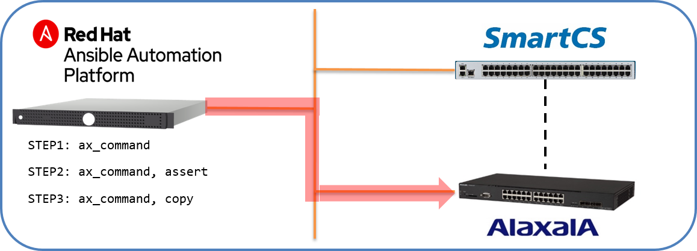

[↑目次に戻る](/README.md)
<br>
# 演習3.3　ALAXALA装置の設定情報を取得する

## 目次
本演習では以下を行います。 
- STEP1. <code>ax_command</code>を使ってALAXALA装置の設定情報を取得する
- STEP2. <code>copy</code>モジュールを利用して取得した情報をファイルとして保存する。
- STEP3. <code>assert</code>モジュールを利用した情報の確認


## 演習構成図



### STEP1. <code>ax_command</code>を使ってALAXALA装置の設定情報を取得する

演習3.2で設定した情報を<code>ax_command</code>を使って取得します。
設定情報を取得するPlaybookは以下の内容となります。

■Playbook(ax_commands.yml)
```
---
- name: ax show commands
  hosts: ax
  gather_facts: no

  vars:
  - ansible_connection: network_cli
  - ansible_network_os: ax
  - ansible_become: yes
  - ansible_become_method: enable
  - ansible_become_pass: 'secret2230'

  tasks:
  - name: execute show commands
    ax_command:
      commands:
        - show version
        - show system
        - show interfaces gigabitethernet 0/1
        - show ip interface
        - show port
        - show vlan 
        - show access-filter
        - show ntp-client
        - show running-config
```

■Playbook内容の説明

◇<code>name: execute show commands</code>

- ax_command:  
ALAXALA装置でコマンドを実行し、その結果を取得する為のモジュールとなります。

- commands:  
実行するコマンドをリスト形式で指定します。


■実行例  
```
$ ansible-playbook ax_commands.yml -vvv
```
実行結果を詳細に表示する為、<code> -vvv</code>オプションを付与します。

■実行結果例  
```
PLAYBOOK: ax_commands.yml *******************************************************************************
1 plays in ax_commands.yml

PLAY [ax show commands] *********************************************************************************
META: ran handlers

TASK [execute show commands] ****************************************************************************

～抜粋～

    "stdout_lines": [
        [
            "Date 1980/05/06 00:38:59 UTC",
            "Model: AX2230S-24T",
            "S/W: OS-LT4 Ver. 2.10 (Build:01)",
            "H/W: AX-2230-24T-B [CA022B24T000S0000C7S013:0]"
        ],

～抜粋～
PLAY RECAP **********************************************************************************************
ax                         : ok=1    changed=0    unreachable=0    failed=0    skipped=0    rescued=0    ignored=0  
```
commandsで指定したCLIが実行され、その結果が取得できました。


### STEP2. <code>assert</code>モジュールを利用した情報の確認

> メモ  
> assertモジュールを使って設定情報やバージョン情報など、チェックを行う。  
> Ansibleで取得した情報を保存してチェックする、という手順ではなく  
> チェックしたい値は直接入力する方向で

### STEP3. <code>copy</code>モジュールを利用して取得した情報をファイルとして保存する

> メモ  
> show running-config などの設定情報をax_command経由で実行しローカルでファイルに保存する。


[→演習3.4 ALAXALA装置の設定情報をSmartCS経由で取得する](/3.4-setting_of_alaxala_device_via_smartcs.md)  
[←演習3.2 ALAXALA装置にSmartCS経由で追加設定を行う](/3.2-additional_setup_the_alaxala_device_via_smartcs.md)    
[↑目次に戻る](/README.md)
