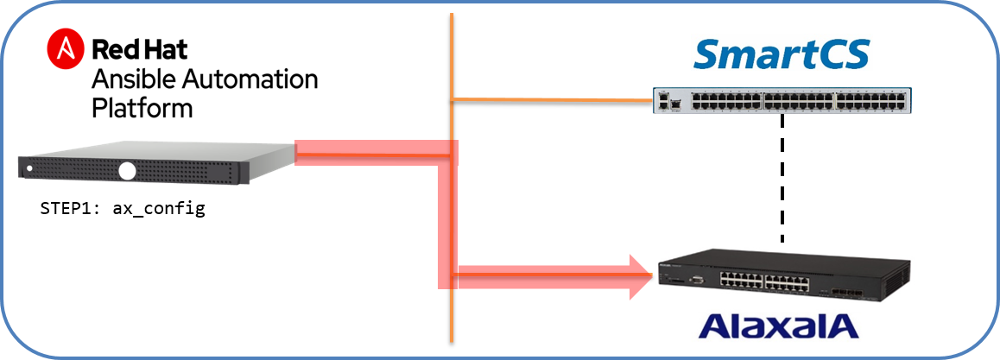
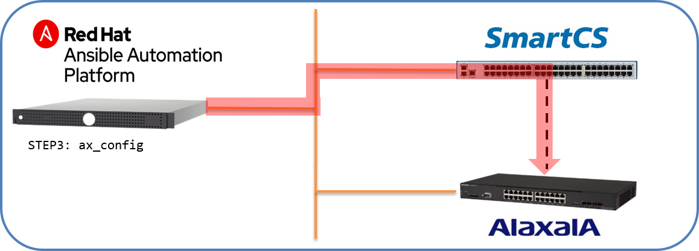

[↑目次に戻る](/README.md)
<br>

# 演習4

演習4ではAnsible、SmartCS、ALAXALA装置を連携した実際のユースケースについての演習を行います。


# 演習4.1　オペミスからの復旧自動化

演習4.1はALAXALA装置に対してアクセスリストを設定後、オペレーションミスでIPリーチができなくなってしまった場合の復旧作業の演習を行います。

## 目次
本演習では以下を行います。  
- STEP1.アクセスリストの設定を行う
- STEP2.手動でオペレーションミスを起こす 
- STEP3.コンソール（SmartCS）経由で設定情報を取得する
- STEP4.コンソール（SmartCS）経由で設定を復旧させる

## 演習構成図




### STEP1.アクセスリストの設定を行う

まずはALAXALA装置に対してアクセスリストの設定を行います。  

演習概要図


設定を行うPlaybook例を以下に記載します。

■(add_acl.yml)
```
---
- name: add acl configration
  hosts: ax
  
  vars:
  - ansible_connection: network_cli
  - ansible_network_os: ax
  - ansible_become: yes
  - ansible_become_method: enable
  - ansible_become_pass: 'secret2230'

  tasks:
  - name: configure access list
    ax_config:
      lines:
        - 10 permit host 172.31.8.41
        - 20 deny any
      parents: ip access-list standard "access ansible host only"
      save_when: changed
  
  - name: set access-list to intarface 
    ax_config:
      lines:
        - ip access-group "access ansible host only" in 
      parents: interface vlan 1
      save_when: changed
```

■Playbook内容の説明  
<configre access list>
<code>"access ansible host only"</code>というアクセスリストのグループを作成し、接続を許可するIPホストを定義します。  
Ansibleホスト以外からの接続を受け付けない設定を投入しています。
  
<set access-list to intarface>
作成したアクセスリストのグループ<code>"access ansible host only"</code>をインターフェース（<code>vlan 1</code>）に設定しています。


■実行例  
```
$ ansible-playbook add_acl.yml 
```


■実行結果例
```
PLAY [add acl configration] *******************************************************************************

TASK [Gathering Facts] ************************************************************************************
ok: [ax2230]

TASK [configure access list] ******************************************************************************
ok: [ax2230]

TASK [set access-list to intarface] ***********************************************************************
ok: [ax2230]

PLAY RECAP ************************************************************************************************
ax2230                     : ok=1    changed=2    unreachable=0    failed=0    skipped=0    rescued=0    ignored=0   
```
これでALAXALA装置にACL設定が投入されました。


<br>
<br>

### STEP2.手動でオペレーションミスを起こす 

手動でオペレーションミスを起こします。  
SSHでALAXALA装置にアクセスして、先ほど設定したACLを手動で変更します。  
```
$ ssh alaxala@ax2230
alaxala@ax2230's password: 

Copyright (c) 2012-2019 ALAXALA Networks Corporation. All rights reserved.

> enable
Password:
# configure 
# (config)# ip access-list standard "access ansible host only"
(config-std-nacl)# show
ip access-list standard "access ansible host only"  
  10 permit host 172.31.8.41 
  20 deny any 
!
(config-std-nacl)# 10 permit host 172.31.8.42
```

誤って設定中のアクセスリストに対して、許可されていたホストを変更してしまいました。  
その為、<code>10 permit host 172.31.8.42</code>を投入後、SSHアクセスした端末から操作ができなくなります。

```
$ ping ax2230
PING ax2230 (172.31.8.223) 56(84) bytes of data.
^C
--- ax2230 ping statistics ---
39 packets transmitted, 0 received, 100% packet loss, time 37999ms

$
$ ssh alaxala@ax2230
ssh: connect to host ax2230 port 22: Connection timed out
$
$ ansible-playbook add_acl.yml 

PLAY [add acl configration] *******************************************************************************

TASK [Gathering Facts] ************************************************************************************
fatal: [ax2230]: FAILED! => {"msg": "timed out"}

PLAY RECAP ************************************************************************************************
ax2230                     : ok=0    changed=0    unreachable=0    failed=1    skipped=0    rescued=0    ignored=0   

$ 
```

pingも応答せず、SSHアクセスも行えない為、ALAXLA装置に対してIPリーチできない状態となりました。  
AnsibleからのアクセスもSSHを利用する為、アクセスすることができない状態です。

### STEP3.コンソール（SmartCS）経由で設定情報を取得する

IPリーチでALAXALA装置にアクセスできない状態ですが、コンソール経由であればアクセスが可能です。
演習3.4のように<code>ax_command</code>をSmartCS経由で実行し、関連する設定情報を取得します。  

■Playbook  
(console_gathering_config.yml)
```
---
- name: gathering configration from console using SmartCS
  hosts: smartcs
  
  vars:
  - ansible_connection: network_cli
  - ansible_network_os: ax
  - ansible_become: yes
  - ansible_become_method: enable
  - ansible_become_pass: 'secret2230'
  - ansible_user: "port1"
  - ansible_password: "port1"
  - ansible_port: 9301

  tasks:
  - name: show commands
    ax_command:
      commands:
        - show ip interface
        - show vlan
        - show access-filter
        - show running-config
```


(gathering_config.yml)
```
---
- name: login by console
  import_playbook: console_login.yml

- name: gathering config
  import_playbook: console_gathering_config.yml  

- name: logout by console
  import_playbook: console_logout.yml
```

■実行例
```
$ ansible-playbook gathering_config.yml 
```

■実行結果例
```
show access-filter 抜粋

        [
            "Date 1980/05/02 02:26:01 UTC",
            "Using Port: interface vlan 1 in",
            "Standard IP access-list: access ansible host only ",
            "  10 permit host 172.31.8.42 ",
            "    matched packets         :          0",
            "  20 deny any ",
            "    matched packets         :        614",
            "  implicitly denied packets :          0"
        ],
```

コンソール経由で<code>ax_command</code>を使い、ALAXALA装置にIPリーチできない状態で設定情報を取得する事ができました。  


### STEP4.コンソール（SmartCS）経由で設定を復旧させる

最後に設定の復旧を行います。  
STEP1で作成した<code>add_acl.yml</code>をコンソール経由で実行します。

■Playbook  
(console_add_acl.yml) add_acl.yml の以下のみを修正    
```
-  hosts: ax
+  hosts: smartcs
+  - ansible_user: "port1"
+  - ansible_password: "port1"
+  - ansible_port: 9301
```
add_acl.ymlとの差分  
- <code>hosts</code>をaxからsmartcsに変更  
- <code>ansible_user: "port1"</code>、<code>ansible_password: "port1"</code>、<code>ansible_port=9301</code>を追記  

(recover_acl.yml)
```
---
- name: login by console
  import_playbook: console_login.yml

- name: add acl configration
  import_playbook: console_add_acl.yml

- name: logout by console
  import_playbook: console_logout.yml
```

■実行例
```
$ ansible-playbook recover_acl.yml
```

■実行結果例
```

PLAY [Login from Console using SmartCS] *******************************************************************

TASK [login ax2230] ***************************************************************************************
ok: [ns2250]

PLAY [add acl configration from console using SmartCS] ****************************************************

TASK [Gathering Facts] ************************************************************************************
ok: [ns2250]

TASK [configure access list] ******************************************************************************
changed: [ns2250]

TASK [set access-list to intarface] ***********************************************************************
ok: [ns2250]

PLAY [Login from Console using SmartCS] *******************************************************************

TASK [logout ax2230] **************************************************************************************
ok: [ns2250]

PLAY RECAP ************************************************************************************************
ns2250                     : ok=5    changed=1    unreachable=0    failed=0    skipped=0    rescued=0    ignored=0   

$ 
```
<code>configure access list</code>のタスクがchangedとなり、STEP1で投入した設定と同じ状態にもどりました。  
ALAXALA装置にログインできるかどうかを認してみます。
```
$ ping -c 3 ax2230
PING ax2230 (172.31.8.223) 56(84) bytes of data.
64 bytes from ax2230 (172.31.8.223): icmp_seq=1 ttl=64 time=1.05 ms
64 bytes from ax2230 (172.31.8.223): icmp_seq=2 ttl=64 time=1.00 ms
64 bytes from ax2230 (172.31.8.223): icmp_seq=3 ttl=64 time=1.05 ms

--- ax2230 ping statistics ---
3 packets transmitted, 3 received, 0% packet loss, time 2002ms
rtt min/avg/max/mdev = 1.008/1.039/1.056/0.043 ms
$ 
$ ssh alaxala@ax2230
alaxala@ax2230's password: 

Copyright (c) 2012-2019 ALAXALA Networks Corporation. All rights reserved.

> 
```

無事アクセスできるようになりました。


## 演習4.1のまとめ

- 万が一オペレーションミスによって設定を変更してしまった場合でも、設定時のPlaybookがあれば、SmartCSと組み合わせることによってIPリーチできない状態でも設定を復旧させることができます。
- SmartCS経由で使う場合でも、Playbookの一部パラメータを変更するだけで冪等性の担保があるベンダー製モジュールを利用することができます。


[→演習4.2 通信障害からの復旧自動化](/4.2-automation_of_recovery_from_network_communication_failures.md)  
[←演習3.4　ALAXALA装置の設定情報をSmartCS経由で取得する](/3.4-setting_of_alaxala_device_via_smartcs.md)   
[↑目次に戻る](/README.md)
