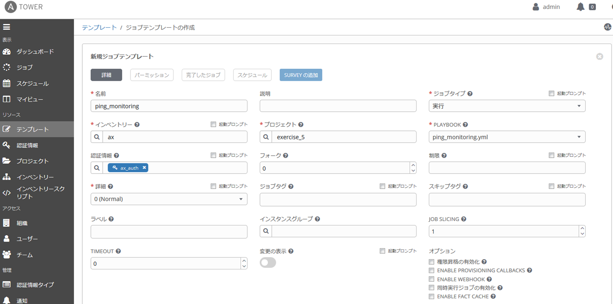
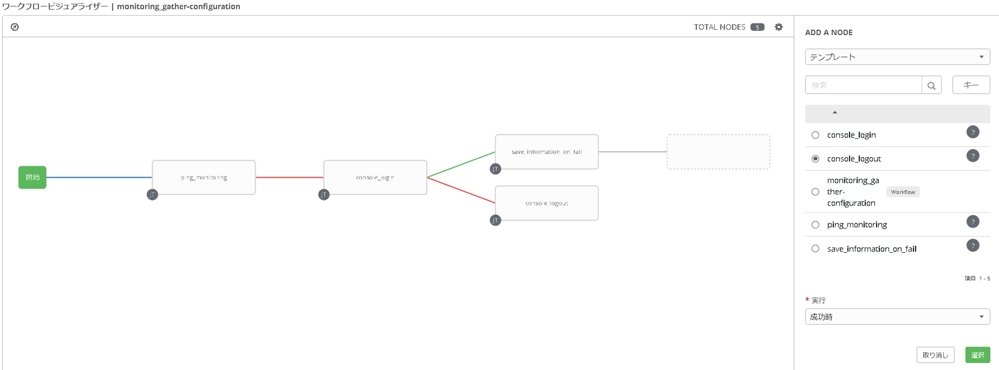
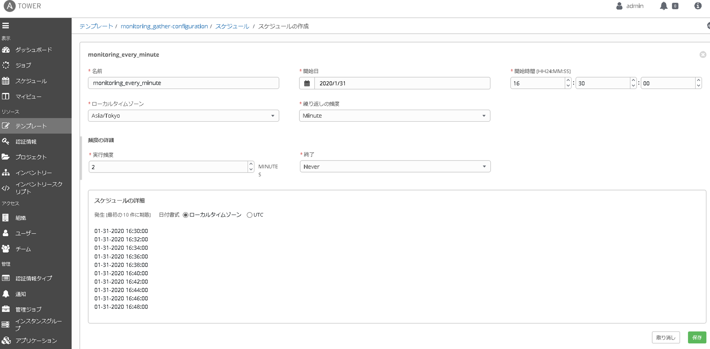

[↑目次に戻る](/README.md)
<br>


# 演習5.2　定期監視と障害発生時の一次情報取得を自動化

演習5.2はALAXALA装置に対して疎通確認を実施し、NW障害やオペレーションミスで疎通確認が失敗した場合の情報取得をワークフロー実行する演習を行います。

## 目次
本演習では以下を行います。  
- STEP1.<code>ping</code>モジュールを利用したALAXALA装置への疎通確認用のPlaybookを作成する
- STEP2.疎通確認から障害時の一次情報取得までの作業のジョブテンプレートを作成する
- STEP3.疎通確認から障害時の一次情報取得までの作業をワークフロー化する
- STEP4.手動でオペレーションミスを起こす
- STEP5.ワークフローを実行し、疎通障害の検出とコンソール（SmartCS）経由で情報取得をする

## 演習構成図

>変更する必要あり

<br>
<br>

### STEP1.<code>ping</code>モジュールを利用したALAXALA装置への疎通確認用のPlaybookを作成する

まずは、演習5.2で使用するPlaybookを作成し、Ansible Towerから実行するための<code>/var/lib/awx/projects/exercise_5</code>ディレクトリを作成します。
以降のPlaybook作成は、下記コマンドにて作成したディレクトリで実施してください。
```
$ mkdir /var/lib/awx/projects/exercise_5
```

STEP1では、ALAXALA装置に対して<code>ping</code>モジュールを利用して疎通確認を行うPlaybookを作成します。
疎通確認を行うPlaybook例を以下に記載します。

■(ping_monitoring.yml)
```yaml
---
- name: monitoring ax connectivity
  hosts: ax
  gather_facts: no

  vars:
  - ansible_connection: network_cli
  - ansible_network_os: ax

  tasks:
  - name: ping monitoring
    ping:
```

■Playbook内容の説明
<code>ping</code>モジュールを利用して、ALAXALA装置への疎通確認を行います。  
コネクションプラグインとして<code>network_cli</code>を利用して、SSHでALAXALA装置に接続できるかどうかを確認します。
- ping:  
<code>hosts</code>で指定した対象装置に対して疎通確認を行います。  
疎通確認方法は、<code>ansible_connection</code>にて指定するコネクションプラグインに依存します。  

  | コネクションプラグイン | 疎通確認方法 |
  | --- | --- |
  | network_cli | SSHで対象装置に接続できるかどうか |
  | ssh / paramiko | SSHでPythonスクリプトを送信し実行できるかどうか |
  | netconf | NETCONFで対象機器に接続できるかどうか |

■実行例  
```
$ ansible-playbook ping_monitoring.yml 
```


■実行結果例
```
PLAY [monitoring ax connectivity] ********************************************************************************

TASK [ping monitoring] *******************************************************************************************
ok: [ax]

PLAY RECAP *******************************************************************************************************
ax                         : ok=1    changed=0    unreachable=0    failed=0    skipped=0    rescued=0    ignored=0
```
ALAXALA装置への疎通性を確認することができました。

<br>
<br>

### STEP2.疎通確認から障害時の情報取得までの作業のジョブテンプレートを作成する

まずは、演習4.1のSTEP3で使用したログイン用、情報取得用、ログアウト用のPlaybookを作業用ディレクトリにコピーします。

```
$ sudo cp /home/rhel01/exercise_4/console_login.yml .
$ sudo cp /home/rhel01/exercise_4/console_logout.yml .
$ sudo cp /home/rhel01/exercise_4/console_gathering_config.yml .
```

演習3.3に記載の「参考」と同様に、SmartCS経由で取得した情報をホスト名と時刻情報を含めたファイル名で保存するために、<code>console_gathering_config.yml</code>のtask部分を以下の内容に書き換えます。

```yaml
tasks:
  - name: show commands
    ax_command:
      commands:
        - show ip interface
        - show vlan
        - show access-filter
        - show running-config
    register: result

  - name: gather ax facts all
    ax_facts:
      gather_subset: all

  - name: save to localfile
    copy:
      content: "{{ result.stdout_lines | join('\n') }}"
      dest: "./log_monitoring-fail_{{ ansible_net_hostname }}_{{ now(False, '%Y%m%d_%H%M%S') }}.txt"
```

■ジョブテンプレートの作成
Ansible Towerへログインし、STEP1で作成した疎通確認用のPlaybookと、上記でコピーした3つのPlaybookを実行するためのジョブテンプレートを作成します。  
ジョブテンプレートの作成時に指定する値のうち、作成例の画面から変更すべき項目を下記の表に記載しています。  

  | インベントリー | Playbook | 認証情報 |
  | --- | --- | --- |
  | AX-2230 | ping_monitoring.yml | ax_auth |
  | NS-2250 | console_login.yml | smartcs_auth_cs-module |
  | NS-2250 | console_gathering_config.yml | smartcs_auth_ax-module |
  | NS-2250 | console_logout.yml | smartcs_auth_cs-module |



上記作成画面は、<code>ping_monitoring.yml</code>を実行するジョブテンプレートの作成例となります。

<br>
<br>

### STEP3.疎通確認から障害時の一次情報取得までの作業をワークフロー化する

■ワークフローテンプレートの作成
STEP2で作成したジョブテンプレートを組み合わせて、死活確認(<code>ping_monitoring.yml</code>)が失敗した時に、コンソール（SmartCS）経由で情報取得(<code>console_gather_configuration.yml</code>)を行うワークフローテンプレートを作成します。



上記作成画面は、<code>console_gather_configuration.yml</code>を実行した後に、成功/失敗に関係なく(常時)<code>console_logout.yml</code>を実行するように設定する際の選択例です。
画面右下の「実行」項目で、1つ前のジョブテンプレートの実行結果に応じて、選択中のジョブテンプレートを実行させることができます。(常時、成功時、障害発生時の3つより選択します。)

<br>
<br>

### STEP4.手動でオペレーションミスを起こす
> この後はSmartCS経由でAX-2230を初期化する演習だけなので、ACLの復旧は不要かもしれない。
手動でオペレーションミスを起こします。  
演習4.1のSTEP2と同様に、SSHでALAXALA装置にアクセスして、設定済みのACLを手動で変更します。  
```
$ ssh alaxala@ax
alaxala@ax's password: 

Copyright (c) 2012-2019 ALAXALA Networks Corporation. All rights reserved.

AX2230> enable
Password:
AX2230# configure 
AX2230# (config)# ip access-list standard "access ansible host only"
!AX2230(config-std-nacl)# show
ip access-list standard "access ansible host only"  
  10 permit host 192.168.127.2 
  20 deny any 
!
!AX2230(config-std-nacl)# 10 permit host 192.168.0.1
!AX2230(config-std-nacl)# packet_write_wait: Connection to 192.168.128.2 port 22: Broken pipe
```

誤って設定済みのACLに対して、許可するホストを変更してしまいました。  
その為、<code>10 permit host 192.168.0.1</code>を投入後、SSHアクセスした端末から操作ができなくなります。
上記の操作により、AnsibleからALAXLA装置に対してIPリーチできない状態となりました。  

<br>
<br>

### STEP5.ワークフローを実行し、疎通障害の検出とコンソール（SmartCS）経由で情報取得をする

IPリーチでALAXALA装置にアクセスできない状態ですが、コンソール経由であればアクセスが可能です。
ALAXALA装置の死活監視を実行し、IPリーチ不可の障害を検出した際に自動で情報を取得できるようにすることで、
障害箇所特定に繋がり得る情報を迅速に取得することができます。


<br>
<br>

## 演習5.2のまとめ

- Ansible Towerのワークフロー機能を利用することで、障害発生を検出した際に即座に必要な情報を取得しておくことが可能です。
- 実際の運用では、スケジューリング機能の設定も行うことで、定期的に死活監視を実施し障害発生時に情報取得を行うことが可能です。



<br>
<br>

[←演習5.1　Ansible Towerのセットアップ](/5.1-setup_Ansible_Tower.md)   
[↑目次に戻る](/README.md)
