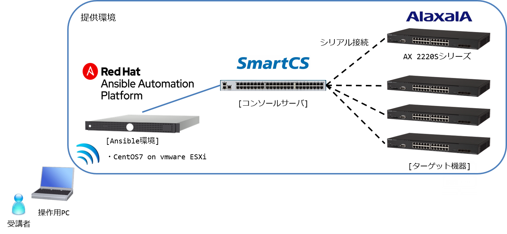

# Ansible x SmartCS x ALAXALA Workshop

## 本ドキュメントについて

本ドキュメントは、Ansibleハンズオンセミナー  
Ansible × SmartCS × ALAXALAネットワークス  
で使用するコンテンツとなります。  

本ワークショップのトレーニングは以下を目的としています。  
- ネットワーク運用におけるAnsibleの使い方
- コンソールサーバ SmartCSの使い方
- ALAXALAネットワーク製品をAnsibleで制御する方法
- Ansible、SmartCS、ALAXALAネットワークス製品を連携させたネットワーク運用の自動化

## ハンズオン環境

### 構成図

### SWバージョン
- Ansible :  2.8.5
- SmartCS modules for Ansible :  Version 1.1
- AX modules for Ansible :  Version 1.4

## ハンズオン内容

### Section.1 - 演習に向けて

 - [[**演習1.1** 演習環境の確認]](1.1-preparing_for_the_exercise.md)

### Section.2 - SmartCS基礎演習

 - [[**演習2.1** SmartCSを介してALAXALA装置へコンソールアクセスする]](2.1-serial_connection_to_alaxala_via_smartcs.md)
 - [[**演習2.2** SmartCSを介したALAXALA装置へのコンソールアクセスを、別セッションでミラーリングする]](2.2-mirroring_operation_of_smartcs.md)
 - [[**演習2.3** SmartCSを介したシリアルセッション情報を確認する]](2.3-checking_serial_session_information_of_smartcs.md)

### Section.3 - Ansible × SmartCS × ALAXALA の連携演習基礎

 - [[**演習3.1** ALAXALA装置にSmartCS経由で初期設定を行う]](3.1-initial_setup_the_alaxala_device_via_smartcs.md)
 - [[**演習3.2** ALAXALA装置にSmartCS経由で追加設定を行う]](3.2-additional_setup_the_alaxala_device_via_smartcs.md)
 - [[**演習3.3** ALAXALA装置の設定情報を取得する]](3.3-get_alaxala_device_information.md)
 - [[**演習3.4** ALAXALA装置の設定情報をSmartCS経由で取得する]](3.4-setting_of_alaxala_device_via_smartcs.md)

### Section.4 - Ansible × SmartCS × ALAXALA の連携演習応用(ユースケース)

 - [[**演習4.1** オペミスからの復旧自動化]](4.1-automation_of_operation_error_recovery.md)
 - [[**演習4.2** 通信障害からの復旧自動化]](4.2-automation_of_recovery_from_network_communication_failures.md)
 - [[**演習4.3** ファームウェアアップデートの自動化]](4.3-automation_of_firmware_update.md)
 - [[**演習4.4** 初期化の自動化]](4.4-automation_of_initialization.md)

### Section.5 - Ansible Tower との連携演習

※演習5では Ansible Tower との連携演習を予定  
　演習4の中で、いくつかを演習5に移動できれば、と思っています。  
　ひとまず全て演習4に記載しておいて、CLIベースのPlaybookを用意して準備しておきます。  

※以下の「演習5.x 監視の自動化」  
　は、CLIベースの演習では出来ない為、演習5として内容を記載します。

- [[**演習5.x** 監視の自動化]](5.x-automation_of_monitering.md)

### Section.6 - 最後に

## 参考情報

